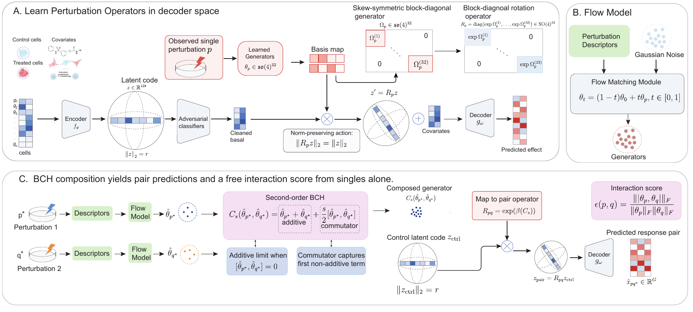

<div align="center">

# OpPert

### Rotation Operators for Single-Cell Perturbation Response Prediction

[Ahmad Farhan](https://github.com/iafarhan)<sup>1</sup> &nbsp;·&nbsp; Suraj Verma<sup>1</sup> &nbsp;·&nbsp; Marianne Abemgnigni Njifon<sup>1</sup> &nbsp;·&nbsp; Mohammed Moustapha Anwar<sup>2</sup> &nbsp;·&nbsp; Maria Angeles Juanes<sup>2</sup> &nbsp;·&nbsp; Annalisa Occhipinti<sup>1,3,4</sup> &nbsp;·&nbsp; Claudio Angione<sup>1,3,4</sup>

<sup>1</sup> School of Computing, Engineering and Digital Technologies, Teesside University, Middlesbrough, UK
<br><sup>2</sup> Cytoskeletal Dynamics in Cell Migration and Cancer Invasion, Prince Felipe Research Center Foundation (CIPF), Valencia, Spain
<br><sup>3</sup> Centre for Digital Innovation, Teesside University, Middlesbrough, UK
<br><sup>4</sup> National Horizons Centre, Teesside University, Darlington, UK

<br>

<!-- TODO: replace the arXiv badge target with the arXiv identifier once the preprint is live -->
[](#)
[](https://huggingface.co/Angione-Lab/OpPert)
[](https://huggingface.co/datasets/Angione-Lab/scFATE-datasets)
[](LICENSE)

</div>

<p align="center">
  
</p>

OpPert models each perturbation as a norm-preserving rotation $R_p \in \mathrm{SO}(4)^{32}$ of the cell's latent representation. Two rotations compose into a pair prediction through Baker–Campbell–Hausdorff, and the resulting Lie bracket gives an interaction score computed from single-perturbation operators alone, without pair supervision. For unseen perturbations, a flow-matching model generates rotations from biological descriptors, with sampling variance serving as a confidence estimate. Across held-out evaluations on three genetic screens (Norman, K562, RPE1), OpPert achieves 82–88% directional accuracy, above existing approaches, and predicted Belinostat targets were validated by RT-qPCR in MCF7 cells.

## Results

Zero-shot perturbation prediction on GEARS-standard splits. $\rho$, $\rho^{\mathrm{DEG}}$: Pearson on all genes and top-20 DEGs. $\mathrm{DA}^{\mathrm{DEG}}$: directional accuracy on top-20 DEGs. $\mathrm{Cos}_{200}$: cosine similarity on top-200 DEGs. All values in %.

| Method | Norman $\rho$ | $\rho^{\mathrm{DEG}}$ | $\mathrm{DA}^{\mathrm{DEG}}$ | $\mathrm{Cos}_{200}$ | K562 $\rho$ | $\rho^{\mathrm{DEG}}$ | $\mathrm{DA}^{\mathrm{DEG}}$ | $\mathrm{Cos}_{200}$ | RPE1 $\rho$ | $\rho^{\mathrm{DEG}}$ | $\mathrm{DA}^{\mathrm{DEG}}$ | $\mathrm{Cos}_{200}$ |
|:--|--:|--:|--:|--:|--:|--:|--:|--:|--:|--:|--:|--:|
| AvgKnown | 39.64 | 58.98 | 61.94 | 54.85 | **36.86** | 46.11 | 56.14 | 42.88 | 54.53 | 57.89 | 32.33 | 53.84 |
| Linear | 37.68 | 55.54 | 61.94 | 51.65 | 25.70 | 32.42 | 52.36 | 30.15 | 38.01 | 40.70 | 30.15 | 37.85 |
| Linear scGPT | 39.20 | 58.66 | 61.94 | 54.55 | 33.86 | 42.97 | 54.37 | 39.96 | 50.09 | 53.95 | 31.31 | 50.17 |
| CellOracle | 9.80 | 12.48 | 16.35 | 11.61 | 4.44 | 5.89 | 41.15 | 5.48 | 39.91 | 7.40 | 23.70 | 6.88 |
| scFoundation | 60.79 | 65.65 | 62.26 | 61.05 | 25.15 | 47.30 | 57.32 | 43.99 | 47.60 | 59.46 | 43.96 | 55.30 |
| scGPT | 61.48 | 65.87 | 74.43 | 61.26 | 32.72 | 43.15 | 57.32 | 40.13 | 50.32 | 65.54 | 67.07 | 60.95 |
| samsVAE | 12.48 | 32.05 | 49.63 | 29.81 | 8.51 | 29.03 | 43.55 | 27.00 | 12.59 | 36.45 | 25.08 | 33.90 |
| GraphVCI | 12.02 | 30.66 | 33.95 | 28.51 | 9.73 | 28.91 | 43.55 | 26.89 | 14.39 | 36.30 | 25.08 | 33.76 |
| GEARS | 45.30 | 63.19 | 69.06 | 58.77 | 32.57 | 42.68 | 56.14 | 39.69 | 48.18 | 53.59 | 32.33 | 49.84 |
| PRESCRIBE | 58.38 | 64.44 | 74.68 | 59.93 | 36.20 | 44.36 | 69.69 | 41.25 | **59.18** | 65.50 | 79.81 | 60.92 |
| **OpPert** | **62.79** | **68.77** | **87.33** | **73.52** | 33.60 | **55.47** | **81.57** | **52.13** | 57.41 | **68.96** | **87.77** | **69.99** |

SciPlex3 (15 held-out drugs):

| Method | $\rho$ | $\rho^{\mathrm{DEG}}$ | $\mathrm{DA}^{\mathrm{DEG}}$ | $\mathrm{Cos}_{200}$ |
|:--|--:|--:|--:|--:|
| AvgKnown | 35.43 | 52.08 | 74.67 | 44.85 |
| Linear (KRR) | 37.12 | 55.15 | 75.00 | 47.03 |
| chemCPA | 28.34 | 47.92 | 67.85 | 39.71 |
| chemCPA (pretrained) | 41.86 | 61.53 | 74.92 | 51.48 |
| SAMS-VAE | 31.67 | 54.82 | 71.63 | 45.91 |
| SAMS-VAE(S) | 38.24 | 61.79 | 75.84 | 52.37 |
| **OpPert** | **44.16** | **64.27** | **79.33** | **54.72** |

## Installation

```bash
git clone https://github.com/iafarhan/oppert.git
cd oppert
pip install -e .
```

Python 3.10+ and PyTorch 2.1+.

## Weights and data

Checkpoints: [huggingface.co/Angione-Lab/OpPert](https://huggingface.co/Angione-Lab/OpPert). Datasets, splits, and descriptors: [huggingface.co/datasets/Angione-Lab/scFATE-datasets](https://huggingface.co/datasets/Angione-Lab/scFATE-datasets).

```bash
pip install -U "huggingface_hub[cli]"
huggingface-cli download Angione-Lab/OpPert --local-dir hub/oppert
huggingface-cli download Angione-Lab/scFATE-datasets --repo-type dataset --local-dir hub/datasets
```

| Screen | Backbone | Flow head |
|:--|:--|:--|
| Norman | `backbones/norman_e115/scFATE_epoch115_best.pt` | `flow_heads/norman/seed{1,2,3}/` |
| K562 | `backbones/k562/scFATE_epoch700_periodic.pt` | `flow_heads/k562/reflow_K2_s1/` |
| RPE1 | `backbones/rpe1_block/scFATE_epoch380_best.pt` | `flow_heads/rpe1/seed1/` |
| SciPlex3 | `backbones/sciplex3/scFATE_epoch199_best.pt` | `sciplex3_path_b/students/mixed18_K16/s{1..7}/` |

Each flow-head directory contains `flow_best.pt`, `krr_prior.pkl`, `config.json`, and the `reproduce.sh` used to train it.

## Reproducing the main table

```bash
mkdir -p checkpoints/norman checkpoints/k562 checkpoints/rpe1 data
ln -s ../../hub/oppert/backbones/norman_e115/scFATE_epoch115_best.pt checkpoints/norman/backbone.pt
ln -s ../../hub/oppert/backbones/k562/scFATE_epoch700_periodic.pt    checkpoints/k562/backbone.pt
ln -s ../../hub/oppert/backbones/rpe1_block/scFATE_epoch380_best.pt  checkpoints/rpe1/backbone.pt
ln -s ../hub/datasets/CRISPRa-norman/norman2019_gears_split.h5ad data/
ln -s ../hub/datasets/replogle_k562/replogle_k562.h5ad           data/
ln -s ../hub/datasets/replogle_rpe1/replogle_rpe1.h5ad           data/

python scripts/reproduce_table1.py --dataset norman --data_dir data/
python scripts/reproduce_table1.py --dataset k562   --data_dir data/
python scripts/reproduce_table1.py --dataset rpe1   --data_dir data/
```

## Figures

Figure scripts read precomputed inputs from `figures/data/` and write to `figures/out/`. No GPU or datasets needed.

```bash
cd figures
python fig_headline_v5_bracket.py
python fig_comp2_results.py
python fig_comp1_reliability.py
python fig_comp3_uncertainty.py
python fig2_geometry.py
```

## Training

Flow head on a pretrained backbone (Norman):

```bash
python scripts/train_flow.py \
    --ckpt checkpoints/norman/backbone.pt \
    --dataset_h5ad data/norman2019_gears_split.h5ad \
    --multiview hub/datasets/gene_embeddings/norman_multiview.pt \
    --output runs/norman_flow_s1 \
    --prior krr --krr_gamma 0.01 --krr_alpha 1.0 \
    --sigma 0.02 --n_steps 20 --d_hidden 512 --n_blocks 4 --seed 1
```

Rectified flow (K562):

```bash
python scripts/train_rectified_flow.py \
    --teacher hub/oppert/flow_heads/k562/base/flow_best.pt \
    --ckpt checkpoints/k562/backbone.pt \
    --dataset_h5ad data/replogle_k562.h5ad \
    --multiview hub/datasets/gene_embeddings/replogle_k562_multiview.pt \
    --output runs/k562_reflow_K2_s1 --K 2 --bracket_reg 1.0 --seed 1
```

SciPlex3:

```bash
python scripts/train_sciplex3_delta_flow.py \
    --dataset_h5ad hub/datasets/sciplex3/sciplex3.h5ad \
    --multiview hub/datasets/drug_embeddings/sciplex3_multiview_v2.pt \
    --ood_json hub/datasets/splits/sciplex3_split_v2b.json \
    --output runs/sciplex3_flow_s1 --prior krr --seed 1
```

See `--help` on any script for all options.

## Citation

```bibtex
@article{farhan2026oppert,
  title   = {Rotation Operators for Single-Cell Perturbation Response Prediction},
  author  = {Farhan, Ahmad and Verma, Suraj and Abemgnigni Njifon, Marianne and Anwar, Mohammed Moustapha and Juanes, Maria Angeles and Occhipinti, Annalisa and Angione, Claudio},
  journal = {arXiv preprint},
  year    = {2026}
}
```

## License

MIT. See [LICENSE](LICENSE).
