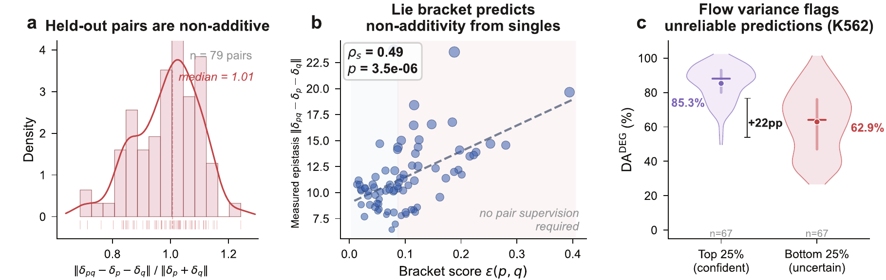
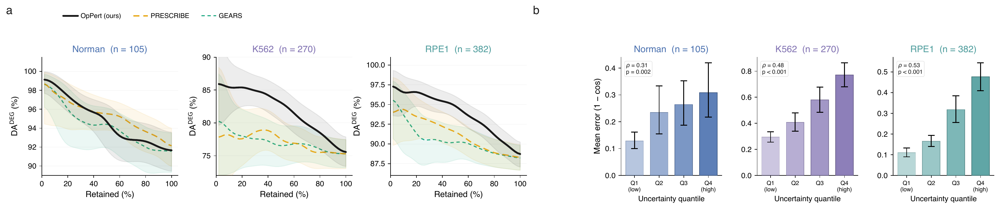

<div align="center">

# OpPert

### Rotation Operators for Single-Cell Perturbation Response Prediction

[Ahmad Farhan](https://github.com/iafarhan)<sup>1</sup> &nbsp;·&nbsp; Claudio Angione<sup>2</sup>

<sup>1</sup> Department of Computer Science and Technology, University of Cambridge
<br>
<sup>2</sup> Department of Computer Science, Teesside University

<br>

<!-- TODO: replace the arXiv badge target with the arXiv identifier once the preprint is live -->
[](#)
[](https://huggingface.co/Angione-Lab/OpPert)
[](https://huggingface.co/datasets/Angione-Lab/scFATE-datasets)
[](LICENSE)
[](pyproject.toml)
[](pyproject.toml)

</div>

<br>

<p align="center">
  
</p>

**(A)** Each perturbation is parameterized as a block-diagonal rotation $R_p \in \mathrm{SO}(4)^{32}$ of the cell's latent code. The rotation preserves $\|z\|_2$ exactly, bounding decoded predictions to the training distribution. **(B)** For unseen perturbations, a conditional flow-matching model maps biological descriptors to rotation generators on the Lie algebra, initialized from kernel ridge regression. **(C)** Two unseen perturbations compose through second-order BCH. The additive term recovers prior linear models and the Lie bracket provides a free interaction score $\varepsilon(p,q)$.

## Abstract

Predicting how cells respond to genetic and chemical perturbations is becoming central to mechanistic biology and drug discovery. However, the space of possible combinations grows quadratically, and identifying which pairs interact non-additively before measuring them remains an open problem. To address this, we introduce OpPert, a new deep learning framework that models each perturbation as a norm-preserving rotation of the cell's latent representation. To model combinations of two perturbations, their rotations compose into a pair prediction via Baker–Campbell–Hausdorff, and the resulting Lie bracket gives their interaction strength. This score is computed from single-perturbation operators alone, without pair supervision, and we show it correlates with measured non-additivity. To infer effects of unseen perturbations, a flow-matching model generates their rotations, with sampling variance serving as a confidence estimate. We validate OpPert both on known benchmarks and experimentally. Across held-out evaluations on three genetic screens (Norman, K562, RPE1), OpPert achieves 82–88% directional accuracy, above existing approaches. We further evaluate OpPert on a small-molecule screen and experimentally validate predicted Belinostat targets by RT-qPCR in a MCF7 cell line, elucidating apoptotic regulators never previously associated with this drug.

## Contributions

1. **Perturbations as rotations.** Modeling perturbations as norm-preserving rotations rather than additive shifts bounds the decoder input to the training distribution and enables algebraic composition.
2. **Algebraic composition with a free interaction diagnostic.** Two rotations compose through Baker–Campbell–Hausdorff. The additive component recovers prior linear models as a special case, and the Lie bracket provides a scalar interaction score computed from singles alone. This score correlates with measured non-additivity (Spearman $\rho = 0.49$, $p = 3.5 \times 10^{-6}$ across 79 held-out pairs).
3. **Flow-based generalization with built-in uncertainty.** A conditional flow on the rotation algebra maps biological descriptors to rotation generators for unseen perturbations. The sampling variance of the flow yields a built-in confidence signal that ranks predictions by reliability without additional parameters or training.
4. **In-vitro experimental validation.** We validate predictions experimentally by RT-qPCR in MCF7 cells treated with Belinostat, confirming predicted gene targets that include apoptotic regulators not previously associated with this drug.

<p align="center">
  
</p>

**(a)** Held-out gene pairs are substantially non-additive, with a median deviation ratio of 1.01 and wide spread (79 pairs from the Norman screen). **(b)** The Lie bracket score $\varepsilon(p,q)$, computed from single-perturbation operators alone, correlates with measured non-additivity (Spearman $\rho_s = 0.49$, $p = 3.5 \times 10^{-6}$). No pair supervision is required. **(c)** Flow sampling variance separates reliable from unreliable predictions on K562 without a dedicated uncertainty module, with the top-25% most confident predictions reaching 85.3% directional accuracy versus 62.9% for the bottom 25% ($\Delta = 22$ pp).

## Method

**Operator.** An encoder $f_\phi$ maps each cell to a latent $z \in \mathbb{R}^{128}$, and a decoder $g_\omega$ maps the latent back to gene expression. A perturbation acts as a block-diagonal rotation of $z$ before decoding. For each block $k \in \{1, \ldots, 32\}$, a learned 6-dimensional vector $\theta_p^{(k)} \in \mathbb{R}^6$ parameterizes a $4 \times 4$ skew-symmetric matrix through a fixed linear map $\beta : \mathbb{R}^6 \to \mathfrak{so}(4)$. Concatenating across the 32 blocks gives the per-perturbation generator $\theta_p \in \mathbb{R}^{192}$, and the operator is

$$
R_p = \operatorname{diag}\bigl(\exp\beta(\theta_p^{(1)}), \ldots, \exp\beta(\theta_p^{(32)})\bigr) \in \mathrm{SO}(4)^{32},
\qquad
\hat{x}_p = g_\omega\bigl(R_p z\bigr).
$$

Rotations exactly preserve the latent norm, so a predicted perturbation cannot move the latent to a magnitude that the decoder never saw during training. The block-diagonal subgroup $\mathrm{SO}(4)^{32}$ is used rather than a dense rotation in $\mathrm{SO}(128)$ because a dense rotation would carry 8,128 parameters per perturbation, far more than the 70 to 1,500 training perturbations available in current screens.

**Composition by Baker–Campbell–Hausdorff.** The pair action is the matrix product $R_p R_q$, applied as $\hat{x}_{pq} = g_\omega(R_p R_q z)$. The BCH formula writes its generator as the sum $\theta_p + \theta_q$ plus a series of nested Lie brackets that collapses to $\theta_p + \theta_q$ exactly when the two generators commute. Keeping the leading non-trivial term,

$$
\theta_{pq} = \theta_p + \theta_q + \tfrac{s}{2}\,[\theta_p, \theta_q] + \mathcal{O}(\|\theta\|_F^3),
$$

where $[\theta_p, \theta_q]$ is the Lie bracket computed block-wise on $\mathfrak{so}(4)$ and the scalar bracket scale $s$ is learned end-to-end. The same bracket gives the **bracket score**

$$
\varepsilon(p, q) = \frac{\|[\theta_p, \theta_q]\|_F}{\|\theta_p\|_F\,\|\theta_q\|_F},
$$

which takes values between zero and two, is zero exactly on commuting pairs, is invariant under any orthogonal change of latent basis, and depends only on the two single generators, so it is available before any pair measurement.

**Generator flow.** For unseen perturbations $p^\star$, a conditional velocity field $v_\psi$ on $\mathfrak{so}(4)^{32}$ maps Gaussian noise plus the descriptor $e_{p^\star}$ to a generator. The flow-matching loss is

$$
\mathcal{L}_{\mathrm{FM}}(\psi) = \mathbb{E}_{p,\,t \sim \mathcal{U}(0,1),\,\theta_0}\,\bigl\|v_\psi(\theta_t, t, e_p) - (\theta_p - \theta_0)\bigr\|_2^2,
\qquad
\theta_t = (1-t)\theta_0 + t\theta_p,\; \theta_0 \sim \mathcal{N}(0, \sigma_0^2 I_{192}).
$$

At inference the flow is Euler-integrated from noise conditioned on $e_{p^\star}$, $M$ samples are averaged on the algebra to form $\hat\theta_{p^\star}$, and the result is exponentiated to give $R_{p^\star}$. The flow is initialized from kernel ridge regression on $(e_p, \theta_p)$ pairs, and a fraction $\rho = 0.2$ of each minibatch is replaced by BCH-composed synthetic pairs from random training singles.

**Per-prediction confidence.** Given $M$ flow samples, the uncertainty score is the coefficient of variation of the decoded shift on the top-DE genes,

$$
u_p = \frac{\bigl\|\operatorname{std}_m\bigl(\hat{\delta}_p^{(m)}\bigr)\bigr\|_{\text{top-DE}}}{\bigl\|\bar{\delta}_p\bigr\|_{\text{top-DE}}},
\qquad
\hat{\delta}_p^{(m)} = g_\omega\bigl(R_{\hat\theta_p^{(m)}} z\bigr) - g_\omega(z).
$$

No additional parameters or training are required beyond the flow already used for prediction.

**Training.** Stage 1 fits the rotation autoencoder jointly with the generator lookup $\{\theta_p\}$ and the bracket scale $s$ under a heteroscedastic Gaussian reconstruction loss, a top-50 DE gene reconstruction term, a composition loss on the multiplicative product $R_p R_q$ against measured combination expression (test pairs never enter this gradient), and an adversarial disentanglement loss. After epoch $E_f$ the decoder is frozen so that all perturbation-specific information must pass through the rotation. Stage 2 fits the flow $v_\psi$ on the resulting lookup.

## Results

### Zero-shot perturbation prediction

Evaluation on three CRISPR screens on GEARS-standard splits: **Norman** (CRISPRa, 105 held-out perturbations including 84 two-gene combinations), **Replogle K562** (CRISPRi, 271 held-out perturbations), and **Replogle RPE1** (CRISPRi, 382 held-out perturbations). $\rho$ and $\rho^{\mathrm{DEG}}$ are Pearson correlation on all genes and on the top-20 differentially expressed genes, $\mathrm{DA}^{\mathrm{DEG}}$ is directional accuracy on the top-20 DEGs, and $\mathrm{Cos}_{200}$ is cosine similarity on the top-200 DEGs. All values in %. Best value per column in bold.

| Method | Norman $\rho$ | $\rho^{\mathrm{DEG}}$ | $\mathrm{DA}^{\mathrm{DEG}}$ | $\mathrm{Cos}_{200}$ | K562 $\rho$ | $\rho^{\mathrm{DEG}}$ | $\mathrm{DA}^{\mathrm{DEG}}$ | $\mathrm{Cos}_{200}$ | RPE1 $\rho$ | $\rho^{\mathrm{DEG}}$ | $\mathrm{DA}^{\mathrm{DEG}}$ | $\mathrm{Cos}_{200}$ |
|:--|--:|--:|--:|--:|--:|--:|--:|--:|--:|--:|--:|--:|
| AvgKnown | 39.64 | 58.98 | 61.94 | 54.85 | **36.86** | 46.11 | 56.14 | 42.88 | 54.53 | 57.89 | 32.33 | 53.84 |
| Linear | 37.68 | 55.54 | 61.94 | 51.65 | 25.70 | 32.42 | 52.36 | 30.15 | 38.01 | 40.70 | 30.15 | 37.85 |
| Linear scGPT | 39.20 | 58.66 | 61.94 | 54.55 | 33.86 | 42.97 | 54.37 | 39.96 | 50.09 | 53.95 | 31.31 | 50.17 |
| CellOracle | 9.80 | 12.48 | 16.35 | 11.61 | 4.44 | 5.89 | 41.15 | 5.48 | 39.91 | 7.40 | 23.70 | 6.88 |
| scFoundation | 60.79 | 65.65 | 62.26 | 61.05 | 25.15 | 47.30 | 57.32 | 43.99 | 47.60 | 59.46 | 43.96 | 55.30 |
| scGPT | 61.48 | 65.87 | 74.43 | 61.26 | 32.72 | 43.15 | 57.32 | 40.13 | 50.32 | 65.54 | 67.07 | 60.95 |
| samsVAE | 12.48 | 32.05 | 49.63 | 29.81 | 8.51 | 29.03 | 43.55 | 27.00 | 12.59 | 36.45 | 25.08 | 33.90 |
| GraphVCI | 12.02 | 30.66 | 33.95 | 28.51 | 9.73 | 28.91 | 43.55 | 26.89 | 14.39 | 36.30 | 25.08 | 33.76 |
| GEARS | 45.30 | 63.19 | 69.06 | 58.77 | 32.57 | 42.68 | 56.14 | 39.69 | 48.18 | 53.59 | 32.33 | 49.84 |
| PRESCRIBE | 58.38 | 64.44 | 74.68 | 59.93 | 36.20 | 44.36 | 69.69 | 41.25 | **59.18** | 65.50 | 79.81 | 60.92 |
| **OpPert** | **62.79** | **68.77** | **87.33** | **73.52** | 33.60 | **55.47** | **81.57** | **52.13** | 57.41 | **68.96** | **87.77** | **69.99** |
| &nbsp;&nbsp; − rotation (additive) | 48.2 | 53.4 | 71.9 | 58.1 | 21.8 | 42.3 | 68.4 | 39.0 | 43.7 | 54.8 | 73.6 | 55.8 |

OpPert achieves the highest $\mathrm{DA}^{\mathrm{DEG}}$ on all three datasets, with gains of +12.7, +11.9, and +8.0 percentage points over the strongest baseline (PRESCRIBE), and leads on $\rho^{\mathrm{DEG}}$ across all datasets. At the gene level, OpPert reduces wrong-direction predictions by 50% on Norman, 39% on K562, and 39% on RPE1. On the 84 held-out Norman pairs stratified by the number of unseen constituent genes, OpPert maintains 92% $\mathrm{DA}^{\mathrm{DEG}}$ when both genes were seen, 91% when one is unseen, and 68% when both are unseen.

The last row replaces the rotation operator with vector-additive composition (the standard latent-shift approach used by scGen, CPA, and GEARS) while keeping the encoder, decoder, and flow architecture identical. The rotation is responsible for 11 to 15 pp of performance across all screens, with the largest drop on Norman (−15.4 pp) where the combination evaluation stresses compositional extrapolation most directly.

### Drug perturbations (SciPlex3)

SciPlex3 is a drug-response screen with 15 held-out drugs. Same metrics as above.

| Method | $\rho$ | $\rho^{\mathrm{DEG}}$ | $\mathrm{DA}^{\mathrm{DEG}}$ | $\mathrm{Cos}_{200}$ |
|:--|--:|--:|--:|--:|
| AvgKnown | 35.43 | 52.08 | 74.67 | 44.85 |
| Linear (KRR) | 37.12 | 55.15 | 75.00 | 47.03 |
| chemCPA | 28.34 | 47.92 | 67.85 | 39.71 |
| chemCPA (pretrained) | 41.86 | 61.53 | 74.92 | 51.48 |
| SAMS-VAE | 31.67 | 54.82 | 71.63 | 45.91 |
| SAMS-VAE(S) | 38.24 | 61.79 | 75.84 | 52.37 |
| **OpPert** | **44.16** | **64.27** | **79.33** | **54.72** |

### Per-prediction confidence from flow variance

<p align="center">
  
</p>

Uncertainty is evaluated by Spearman rank correlation (SPCC) between predicted uncertainty and actual prediction error. OpPert exceeds PRESCRIBE's dedicated Natural Posterior Network on K562 (SPCC 48% vs. 14%) and RPE1 (53% vs. 29%), the two datasets with the widest accuracy spread across perturbations. Retaining only the most confident predictions monotonically improves $\mathrm{DA}^{\mathrm{DEG}}$ on all three datasets, with OpPert's risk-coverage curve above both PRESCRIBE and GEARS on K562 and RPE1.

### Operator geometry

The median eigenangle of learned rotation operators is 0.114 rad. 92% of operators fall within $\pi/8$ and 99.6% within $\pi/4$, so the BCH series converges rapidly and the truncation to the first-order commutator is valid. Block size $r = 4$ is optimal because $r = 2$ collapses to an abelian torus where every bracket vanishes, and freezing the decoder (coordinate lock) is the single largest contributor to compositional accuracy, with no-lock dropping to 75.4%.

### In-vitro experimental validation

To test whether OpPert predictions transfer to an independent experimental modality, we selected Belinostat, a well-characterized HDAC inhibitor present in the SciPlex3 screen, and identified four candidate genes from differential expression analysis between predicted Belinostat-treated and control profiles in MCF7 cells: *PDE4D* (cyclic nucleotide signaling), *PRKCA* and *PRKCB* (protein kinase C signaling), and *ACSBG1* (fatty-acid β-oxidation). RT-qPCR in MCF7 cells treated with 10 µM Belinostat for 24 h confirms statistically significant expression changes in the predicted direction for three genes. *PRKCA* and *PRKCB* reach $p < 0.001$, consistent with adaptive kinase signaling in response to HDAC inhibition, while *PDE4D* is significant at $p < 0.01$, reflecting stress-response signaling not previously associated with Belinostat.

## Installation

```bash
git clone https://github.com/iafarhan/oppert.git
cd oppert
pip install -e .
```

Requires Python 3.10+ and PyTorch 2.1+. Dependencies are listed in `pyproject.toml`.

## Pretrained weights

All checkpoints are hosted at [huggingface.co/Angione-Lab/OpPert](https://huggingface.co/Angione-Lab/OpPert). Each flow-head directory holds `flow_best.pt` (with embedded hyperparameters), `config.json`, `krr_prior.pkl`, `flow_metrics.jsonl`, and the exact `reproduce.sh` used for training. `MANIFEST.json` on the Hub maps every run to its paper row.

| Screen | Stage 1 backbone (rotation autoencoder) | Stage 2 flow head |
|:--|:--|:--|
| Norman (CRISPRa) | `backbones/norman_e115/scFATE_epoch115_best.pt` | `flow_heads/norman/seed{1,2,3}/flow_best.pt` |
| Replogle K562 (CRISPRi) | `backbones/k562/scFATE_epoch700_periodic.pt` | `flow_heads/k562/base/` (teacher), `flow_heads/k562/reflow_K2_s1/` (rectified, reported) |
| Replogle RPE1 (CRISPRi) | `backbones/rpe1_block/scFATE_epoch380_best.pt` | `flow_heads/rpe1/seed1/flow_best.pt` |
| SciPlex3 (drugs) | `backbones/sciplex3/scFATE_epoch199_best.pt` | `sciplex3_path_b/teachers/{priorkrr,priornone}/s{1..9}`, `sciplex3_path_b/students/mixed18_K16/s{1..7}` |

```bash
pip install -U "huggingface_hub[cli]"
huggingface-cli download Angione-Lab/OpPert --local-dir hub/oppert
```

## Data

Processed datasets, GEARS-standard splits, and the multi-view perturbation descriptors are hosted at [huggingface.co/datasets/Angione-Lab/scFATE-datasets](https://huggingface.co/datasets/Angione-Lab/scFATE-datasets).

| File | Content |
|:--|:--|
| `CRISPRa-norman/norman2019_gears_split.h5ad` | Norman 2019 CRISPRa screen with GEARS split |
| `replogle_k562/replogle_k562.h5ad` | Replogle 2022 K562 CRISPRi screen |
| `replogle_rpe1/replogle_rpe1.h5ad` | Replogle 2022 RPE1 CRISPRi screen |
| `sciplex3/sciplex3.h5ad`, `splits/sciplex3_split_v2b.json` | SciPlex3 drug screen and held-out drug split |
| `gene_embeddings/{norman,replogle_k562,replogle_rpe1}_multiview.pt` | 1824-dim multi-view gene descriptors |
| `drug_embeddings/sciplex3_multiview_v2.pt` | Multi-view drug descriptors |

```bash
huggingface-cli download Angione-Lab/scFATE-datasets --repo-type dataset --local-dir hub/datasets
```

The same data and checkpoints are mirrored as a single bundle on [Google Drive](https://drive.google.com/file/d/1JIaMp3HKtavnjBfsEcMnLOFEMmUBLiyv/view?usp=sharing) (`oppert_data_checkpoints.zip`, which unpacks into `checkpoints/` and `data/`).

## Reproducing the main table

`scripts/reproduce_table1.py` expects `checkpoints/<screen>/backbone.pt` and the h5ad files under `data/`. Link the downloaded files into that layout:

```bash
mkdir -p checkpoints/norman checkpoints/k562 checkpoints/rpe1 data
ln -s ../../hub/oppert/backbones/norman_e115/scFATE_epoch115_best.pt checkpoints/norman/backbone.pt
ln -s ../../hub/oppert/backbones/k562/scFATE_epoch700_periodic.pt    checkpoints/k562/backbone.pt
ln -s ../../hub/oppert/backbones/rpe1_block/scFATE_epoch380_best.pt  checkpoints/rpe1/backbone.pt
ln -s ../hub/datasets/CRISPRa-norman/norman2019_gears_split.h5ad data/
ln -s ../hub/datasets/replogle_k562/replogle_k562.h5ad           data/
ln -s ../hub/datasets/replogle_rpe1/replogle_rpe1.h5ad           data/
```

```bash
python scripts/reproduce_table1.py --dataset norman --data_dir data/
python scripts/reproduce_table1.py --dataset k562   --data_dir data/
python scripts/reproduce_table1.py --dataset rpe1   --data_dir data/
```

Each run prints $\mathrm{DA}^{\mathrm{DEG}}$, $\rho^{\mathrm{DEG}}$, and $\mathrm{Cos}_{200}$ next to the reported value and writes `results_<screen>.json`.

| Screen | $\mathrm{DA}^{\mathrm{DEG}}$ | $\rho^{\mathrm{DEG}}$ | $\mathrm{Cos}_{200}$ |
|:--|--:|--:|--:|
| Norman | 87.33 | 68.77 | 73.52 |
| K562 | 81.57 | 55.47 | 52.13 |
| RPE1 | 87.77 | 68.96 | 69.99 |

## Reproducing the figures

The scripts under `figures/` regenerate the results panels from the precomputed prediction dumps in `figures/data/`. They need neither a GPU nor the datasets. Outputs are written to `figures/out/` as PDF, PNG, and SVG.

```bash
cd figures
python fig_headline_v5_bracket.py   # non-additivity of held-out pairs, bracket score vs. epistasis, flow-variance split
python fig_comp2_results.py         # cross-method results, gene-level scatter, per-pair distributions, difficulty strata
python fig_comp1_reliability.py     # BCH landscape, bracket calibration, reliability diagnostics
python fig_comp3_uncertainty.py     # risk-coverage curves and error by uncertainty quartile
python fig2_geometry.py             # latent-space rotation geometry
```

## Training

Pretrained Stage 1 backbones for all four screens are on the Hub. The scripts below train the flow head on top of a backbone.

**Stage 2: generator flow** (Norman, KRR-initialized, matching the released `flow_heads/norman/seed1`):

```bash
python scripts/train_flow.py \
    --ckpt checkpoints/norman/backbone.pt \
    --dataset_h5ad data/norman2019_gears_split.h5ad \
    --multiview hub/datasets/gene_embeddings/norman_multiview.pt \
    --output runs/norman_flow_s1 \
    --prior krr --krr_gamma 0.01 --krr_alpha 1.0 \
    --sigma 0.02 --n_steps 20 --d_hidden 512 --n_blocks 4 \
    --seed 1
```

**Stage 3 (optional): rectified flow** (K562, distilled from the base flow with $K = 2$):

```bash
python scripts/train_rectified_flow.py \
    --teacher hub/oppert/flow_heads/k562/base/flow_best.pt \
    --ckpt checkpoints/k562/backbone.pt \
    --dataset_h5ad data/replogle_k562.h5ad \
    --multiview hub/datasets/gene_embeddings/replogle_k562_multiview.pt \
    --output runs/k562_reflow_K2_s1 \
    --K 2 --bracket_reg 1.0 --seed 1
```

**SciPlex3 drug flow**:

```bash
python scripts/train_sciplex3_delta_flow.py \
    --dataset_h5ad hub/datasets/sciplex3/sciplex3.h5ad \
    --multiview hub/datasets/drug_embeddings/sciplex3_multiview_v2.pt \
    --ood_json hub/datasets/splits/sciplex3_split_v2b.json \
    --output runs/sciplex3_flow_s1 \
    --prior krr --seed 1
```

Run any script with `--help` for the full list of options. The `reproduce.sh` shipped with every released flow head records the exact hyperparameters of that run.

## Repository layout

```
oppert/                 model code
  rotation.py             block-diagonal SO(4)^32 operator, closed-form exponential, Lie bracket
  flow.py                 conditional velocity field, flow-matching loss, BCH composition, sampling
  model.py                rotation autoencoder, adversarial disentanglement, two-stage training
  layers.py               SwiGLU residual MLPs, gated residual decoder
  losses.py               heteroscedastic NLL, DEG-weighted reconstruction, composition loss
  embedding.py            perturbation descriptor handling
  preprocess.py           dataset preprocessing and split construction
scripts/
  reproduce_table1.py     main-table evaluation from released checkpoints
  train_flow.py           Stage 2 flow head
  train_rectified_flow.py Stage 3 rectified flow
  train_sciplex3_delta_flow.py   SciPlex3 drug flow
  eval_fair_comparison.py, eval_flow_fair.py, eval_flow_uncertainty.py, train_gene2rot.py,
  verify_checkpoints.py   evaluation and diagnostics used for the paper; depend on an internal
                          evaluation harness that is not part of this release
configs/                run configurations for the released checkpoints
figures/                figure scripts; precomputed inputs in figures/data, outputs in figures/out
assets/                 figures used in this README
```

## Citation

```bibtex
@article{farhan2026oppert,
  title   = {Rotation Operators for Single-Cell Perturbation Response Prediction},
  author  = {Farhan, Ahmad and Angione, Claudio},
  journal = {arXiv preprint},
  year    = {2026}
}
```

## License

This repository is released under the MIT License. See [LICENSE](LICENSE).
